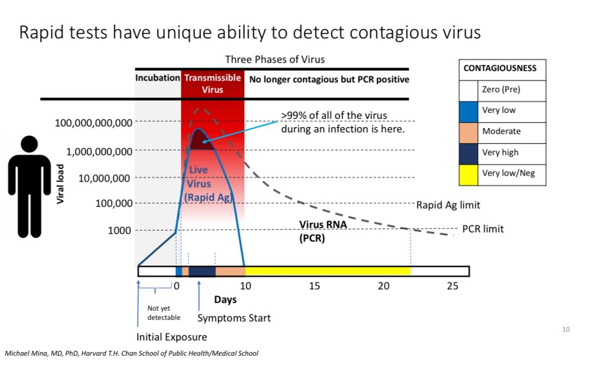

- [Sind PCR Tests wirklich sinnvoll?](#sind-pcr-tests-wirklich-sinnvoll)
  - [Grundlagen](#grundlagen)
    - [Typischer Verlauf einer Infektion](#typischer-verlauf-einer-infektion)
    - [Vor und Nachteile PCR/LFT](#vor-und-nachteile-pcrlft)
  - [Wozu testen?](#wozu-testen)

# Sind PCR Tests wirklich sinnvoll?

Seit Monaten wird wiederholt von Journalisten und Professoren behauptet, dass PCR Tests notwendig seien, um die Corona Situation in den Griff zu bekommen.
Dies wird üblicherweise mit höherer Sensitivität argumentiert.

Ein paar Beispiele:

- Armin Wolf (Interview mit Mückstein, Mitte Oktober, ZIB2)
  - > In Oberösterreich, wo es die meisten Neuinfektionen gibt, da 
reicht für 3G ein Antigentest, obwohl alle Experten seit vielen 
Monaten warnen, dass die sehr unzuverlässig sind. In Wien, das 
viel weniger Infektionen hat, braucht man einen PCR-Test. Warum 
ist das nicht bundesweit einheitlich? 

- Drosten (Die Zeit, 2021-11-25, [Link](../pdfs/drosten-zeit.pdf))

- ~~Diverse Provinz-Experten~~ Österreichs Top-WissenschaftlerInnen (Offener Brief, [Artikel im Standard](https://www.derstandard.at/story/2000131132704/wissenschafter-fordern-in-einem-statement-konsequente-massnahmen), [Twitter](https://twitter.com/lou_lorenz/status/1459226196361764866/photo/2))
  - > Aus 2G muss ein **2G plus** (Geimpft /genesen  + PCR getestet) werden

## Grundlagen

### Typischer Verlauf einer Infektion

Wenn sich eine Person mit Corona angesteckt hat, vermehren sich die Viren eine Zeit lang (ungefähr exponentiell), was zu einer zunehmend höheren Virenbelastung (Viral Load, Anzahl Viren / mL) führt.

- Ab einem Schwellwert `x` kann man die Infektion mittels PCR Test nachweisen.
- Bei einer etwa 100 mal höheren Virenbelastung ist auch ein Antigentest (kurz LFT - Lateral Flow Test) in der Lage, die Infektion zu erkennen. 
- Die Viren vermehren sich weiterhin und die Person wird zunehmend ansteckender
- Irgendwann bricht die Krankheit aus (bei Corona typischerweise nach 3-5 Tagen, = Inkubationszeit) - was sich in der Regel mit gewissen Symptomen
- Das Immunsystem reagiert auf den Virus, bildet Antikörper (und alles mögliche andere Zeug) - Viren im Körper werden wieder weniger
  - wenn die Virusbelastung wieder unter den Schwellwert des LFT sinkt, ist ein Antigentest nicht mehr positiv
  - selbiges für PCR (mit entsprechend niedrigerem Schwellwert)

Das ganze ist in folgender Graphik (erstellt von Michael Mina MD, PhD - damals noch bei Harvard) illustriert den Verlauf:

### Vor und Nachteile PCR/LFT

PCR:
- `+` Sensitiv (kann Infektion bei geringerer Virusbelastung erkennen)
- `+` Es ist möglich Infizierte zu erkennen, bevor diese ansteckend sind
- `-` Test ist noch eine Zeit lang positiv, nachdem man die Krankheit bereits überstanden hat
- `-` Durchführung benötigt geschultes Personal und dauert länger
- `-` Lange Wartezeit auf Testergebnis

LFT (Antigen Test):
- `+` Erkennt ansteckende Personen zuverlässig (relativ - dazu später mehr)
- `+` Ergebnis nach 15 Minuten verfügbar
- `+` kein geschultes Personal notwendig
- `-` möglicherweise bei Geimpften Personen weniger sensitiv (dazu später auch mehr)

## Wozu testen? 
Damit man weiß ob man Corona hat. Warum aber will man das wissen?
Dafür kann es verschiedene Motivationen geben:
- um mögliche Behandlungen rechtzeitig zu beginnen (je nach Vorliebe mit Bitterstoffen & Entwurmungsmitteln oder einem der demnächst verfügbaren Medikamente die wirklich gegen COVID helfen - Molnupavir/Paxlovid/...)
- aus Neugierde ("warum fühle ich mich so scheiße obwohl ich gestern nicht gesoffen habe?")
- damit man seine Mitmenschen nicht ansteckt (indem man sich rechtzeitig isoliert). 

Aus Public Health Perspektive ist aktuell ausschliesslich das letzte von Bedeutung.
Je weniger ansteckende Personen mit ihren Mitmenschen interagieren, desto weniger Ansteckungen führen zu schweren Verläufen und Problemen im Gesundheitsapparat.

Aus 
